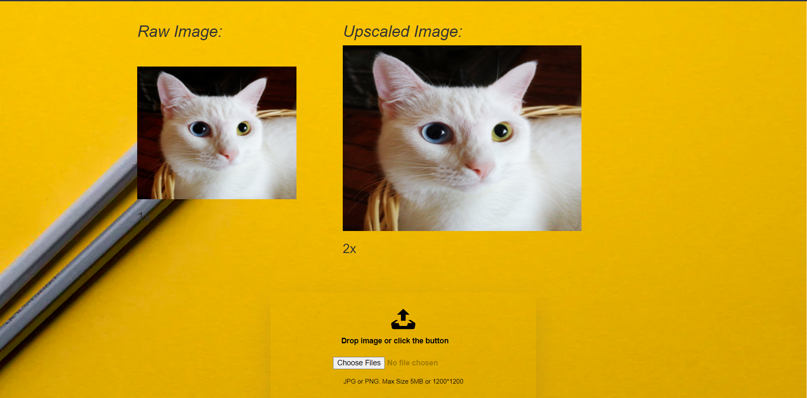

#Upscaling Image using Deep Learinga and Deploying using django as backend

To run Server on Local machine for image Upscaling
`python manage.py runserver`

 # UI
 
 
# For Training Model

- Fork the Main Repo Of [Image Upscaling](https://github.com/vaibhavhariaramani/Image_Upscaling_Algorithms) .
- In that Repo open `1_SRCNN`.
- Either use ipynb on various dataset or 
- To train the model with a zoom factor of 2, for 200 epochs and on GPU:

`python main.py --zoom_factor 2 --nb_epoch 200 --cuda`

At each epoch, a `.pth` model file will be saved.

To use the model on an image: (the zoom factor must be the same the one used to train the model)

`python run.py --zoom_factor 2 --model model_199.pth --image example.jpg --cuda`

# Example

Original image:

Bicubic interpolation zoom:

SRCNN zoom:

